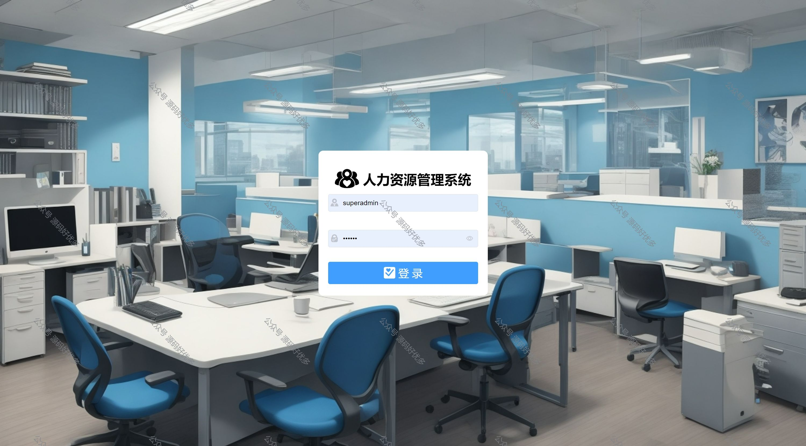

 
## 查看主页获取源码

> **作者介绍**： **✌**全网粉丝10W+本平台特邀作者、博客专家、CSDN新星计划导师、java领域优质创作者,博客之星、掘金/华为云/阿里云/InfoQ等平台优质作者、专注于毕业项目实战 **✌**

  

### 一、作品包含

源码+数据库+设计文档万字+全套环境和工具资源+部署教程

### 二、项目技术

前端技术：Html、Css、Js、Vue、Element-ui

数据库：MySQL

后端技术：Java、Spring Boot、MyBatis

  

### 三、运行环境

开发工具：IDEA/eclipse

数据库：MySQL8.0

数据库管理工具：Navicat10以上版本

环境配置软件： JDK1.8+Maven3.6.3

前端Nodejs：16

  

### 四、项目介绍
项目编号：springbootA024

基于SpringBoot+Vue实现的人力资源管理系统是为了提高企业人力资源管理水平而开发的。主要目标是通过对员工及人力资源活动信息（考勤、工资)等的编制来提高企业效率。
系统一共分为五大菜单项，分别是首页、薪资管理、权限管理、系统管理、考勤管理
1、首页
系统统计信息，包括员工情况、登录用户信息、考勤记录、城市社保缴纳比例、员工入职情况、员工分布情况等
(以折线图、柱状图、饼图展示)
2、薪资管理
五险一金：根据参保城市设置的比例，计算缴纳的五险一金金额
参保城市：设置各参保城市的五险一金缴纳比例、缴纳上下限
工资管理：计算员工工资情况(除去五险一金、考勤扣款)
3、权限管理
角色管理：对系统角色进行新增、修改、删除、授权、导入、导出等操作
菜单管理：对系统菜单进行新增、修改、删除、授权、导入、导出等操作
4、系统管理
文件管理：对系统上传文件进行上传、修改、删除、授权、导入、导出、下载等操作
员工管理：对系统员工进行新增、修改、删除、分配角色、导入、导出等操作
部门管理：对系统菜单进行新增、修改、删除、设置考勤、导入、导出等操作
5、考勤管理
请假审批：对员工的请假流程进行审批、导出等操作
考勤表现：对员工的考勤数据进行管理、导入、导出等操作

### 五、运行截图

  
